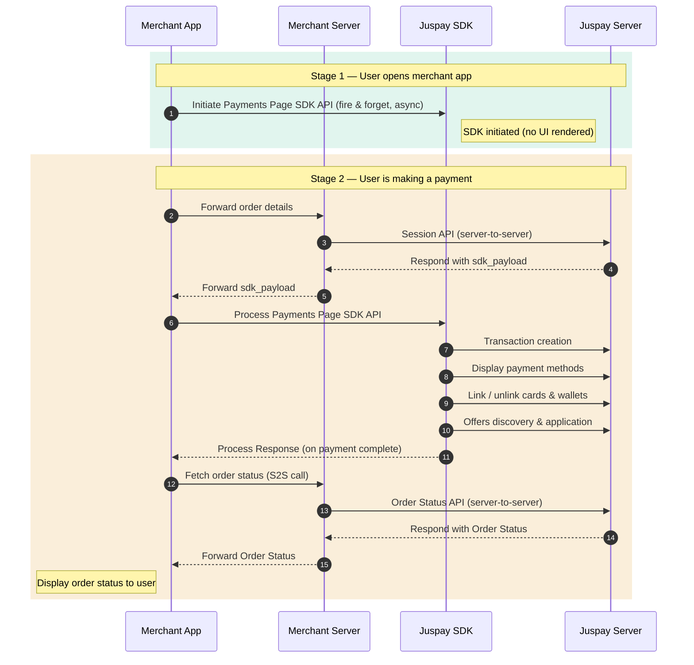
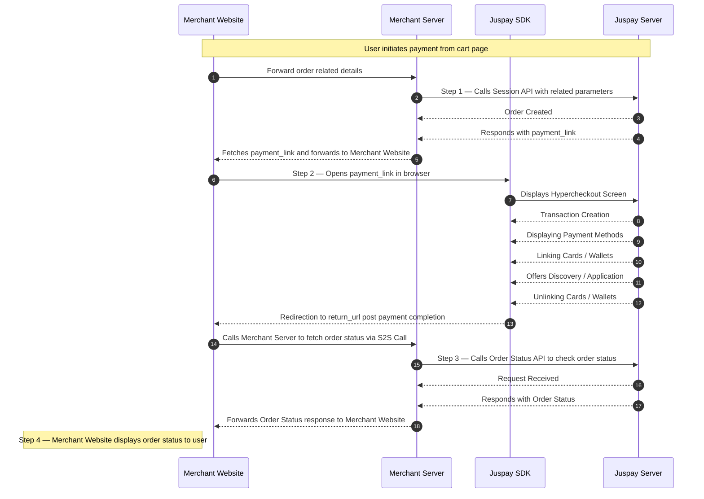
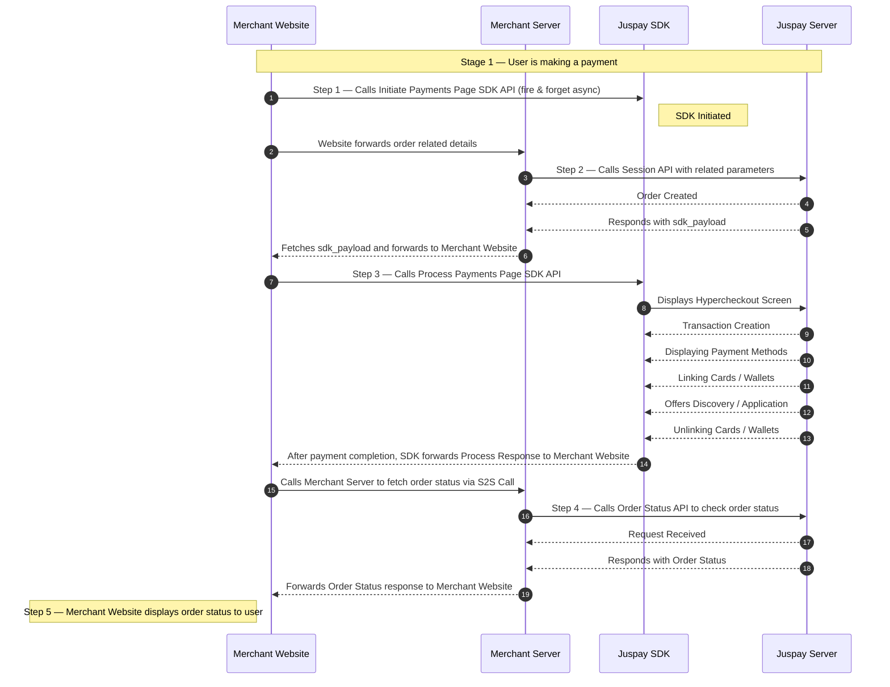
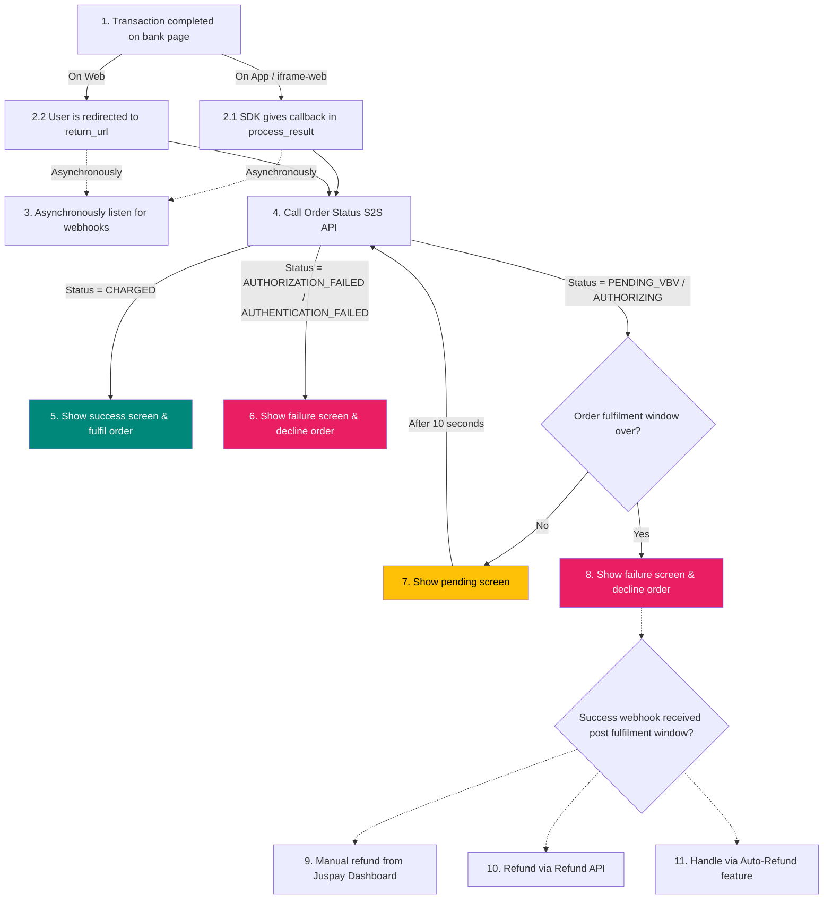

<!-- Orchestrator skill: owns the agent's working sequence and the cross-cutting
     non-negotiables. The juspay-docs MCP is the final source of truth for the
     integration steps, payloads, platform specifics, and all cross-cutting
     detail (auth, webhooks, errors, status) — redirect there, don't re-narrate. -->

> **MCP `integration_type`:** `payment-page-cat` (API-key auth) or
> `payment-page-signature` (signature auth) — determined with the merchant.
> Auth detail is in the docs (`overview/pre-requisites`, `base-sdk-integration/session`).

# HyperCheckout — integration orchestrator

Juspay hosts the payment page. The merchant's backend creates a session, hands
the returned `sdk_payload` to the merchant app, the Juspay SDK opens the hosted
checkout, and the merchant reconciles the outcome.

This card owns *how the agent should work* and the *non-negotiables*. The
**juspay-docs MCP is the final source of truth** for the integration steps,
payloads, and platform specifics — read the docs, don't guess.

## When to use

The merchant wants Juspay to host the payment UI — payment methods, gateway
interactions, offers, saved instruments. Their job: create a session, hand off
to the SDK, reconcile.

Wrong card if the merchant wants their own payment UI — see
`integrations/express-checkout-sdk/` or `integrations/express-checkout-api/`.

## Integration architecture

The flow forks by platform. **Pick the diagram matching the merchant's platform
and read it alongside that platform's docs** — it's the flow reference the docs
describe step by step.

### Native SDK — `android · ios · flutter · react-native · cordova · capacitor`

Stage 1 *initiate* is a fire-and-forget warm-up on app load; Stage 2 *process*
is the real payment flow. The SDK returns a `process_result`.

### Web — redirect — `web`

The Session API returns a `payment_link`; the browser opens it and Juspay
redirects back to `return_url` after payment. No SDK initiate/process step.

### Web — iframe — `iframe-web`

Like the native flow but in the browser — *initiate* (fire & forget), Session
returns `sdk_payload`, *process* opens the iframe, and the SDK forwards a Process
Response to the website.

## Payment response handling

Once the payment completes, this is the decision tree the merchant must
implement. The Order Status call is the source of truth — the SDK callback, the
redirect, and webhooks only *trigger* it.

- **Pending is not terminal.** On `PENDING_VBV` / `AUTHORIZING`, re-poll Order
  Status every ~10s until it resolves or the order-fulfilment window closes.
- **A window-expired pending order is declined** — but a success webhook can
  still arrive afterwards. If it does, refund it (Dashboard manual refund, the
  Refund API, or the Auto-Refund feature).
- Status-value interpretation beyond this flow: the `resources/transaction-status` doc.

## How to integrate — agent workflow

1. **Confirm platform and auth scheme** with the merchant — this fixes the
   `integration_type`, which architecture diagram to follow (Native SDK / Web
   redirect / Web iframe, above), and which docs to read. Platforms: `android ·
   ios · web · flutter · react-native · cordova · capacitor · iframe-web`.
2. **Fetch the docs via the juspay-docs MCP** — the architecture page and the
   platform's `base-sdk-integration` pages (see Documentation map). Use the
   mermaid above as the flow reference while reading.
3. **Implement per the platform docs** — session creation (S2S), SDK
   initiate/process, payment-response handling. The docs own the payloads and
   the platform specifics; follow them exactly.
4. **Enforce the Non-negotiables below** on every platform — the docs don't
   always foreground them.

## Documentation map

Fetch docs through the **juspay-docs MCP** — see `mcp/juspay-docs-mcp/` for the
server, tools, and workflow. In short: `list_doc_sources` with the merchant
context + this card's `integration_type` (top of card) → the HyperCheckout doc
index → `fetch_docs` the pages below. Page slugs vary slightly by platform —
match against what the index returns. Do **not** fetch `juspay.io` URLs directly.

**Core integration path** — the pages a baseline integration needs:

| Page (in the index) | Read it for |
|---------------------|-------------|
| `overview/pre-requisites` | Credentials, API-key generation, restricted-mode caps |
| `overview/integration-architecture` | The flow (an image — the mermaid above is the text form) |
| `base-sdk-integration/session` | Create-session request/response, `metadata.*` params |
| `base-sdk-integration/getting-sdk` … `life-cycle-events` | Platform SDK: install, initiate, open, handle response |
| `base-sdk-integration/order-status-api` | Reconciliation call |
| `base-sdk-integration/webhooks` | Webhook config & receipt |
| `base-sdk-integration/refund-order-api`, `cancel-api` | Refunds, pre-payment cancellation |
| `resources/{transaction-status, error-codes, test-resources, sample-payloads}` | Status enum, errors, sandbox testing |

**Beyond baseline** — this card deliberately does not enumerate the rest of the
HyperCheckout docs. When the merchant needs a feature outside the core flow —
mandates / subscriptions, card-network tokenization, CVV-less, offers, payment
locking, split settlements, EMI, clickstream events — pull the relevant section
from the same index. As-needed references:
`resources/configurations--capabilities`, `resources/code-snippets`,
`faqs/common-faqs`.

## Non-negotiables

Enforce these regardless of platform:

- **Reconcile via Order Status — mandatory.** After the SDK's `process_result`,
  call Order Status (S2S) to determine the real outcome. `process_result` and
  the `return_url` redirect only signal that the flow ended, not that it
  succeeded.
- **Reconcile via webhooks too.** Webhook config is mandatory; use webhooks
  *and* Order Status — neither alone is reliable. Receiver mechanics (auth,
  dedup, return 200): the `base-sdk-integration/webhooks` doc.
- **Integrity check.** Never mark an order "Paid" unless the Juspay-returned
  `amount` matches the amount in your DB. Validate `status` *and* `amount`
  before fulfilment.
- **Graceful error handling — both ends.** Handle API timeouts, Juspay server
  errors, and malformed payloads on both frontend and backend. Error catalogue:
  the `resources/error-codes` doc.

## Gotchas (digest)

Consolidated from warnings scattered across the docs:

- **`order_id` is the idempotency key** — unique, ≤ 21 alphanumeric chars.
  Generate and persist it before the first `/session` call; reuse it on retry.
- **`x-routing-id` must be consistent** — the same value (the `customer_id`, or
  an order/cart id for guests) on every call for that customer.
- **The session payload expires** — `sdk_payload.clientAuthTokenExpiry`
  (native / iframe) or the `payment_link` validity (web redirect). If the user
  returns later, re-issue `/session` with the same `order_id` to refresh it.
- **`return_url`** must be HTTPS, no query params, no IP, no onward redirect — or
  the SDK won't close after the transaction.
- **Webhooks can arrive more than once** — process idempotently, always return
  HTTP 200.
- **Restricted mode** — fresh production accounts are capped at 200 txns/day and
  ₹100/order until the integration checklist is signed off.

## Refunds & cancellation

- **Refund** a charged order — `refund-order-api`. Completion is async;
  reconcile via the refund webhook + Order Status.
- **Cancel** an order before payment — `cancel-api`.

## Testing checklist

Against sandbox (`https://sandbox.juspay.in`; test data in `resources/test-resources`):

- [ ] Session creation returns the `sdk_payload`; the SDK opens the hosted page.
- [ ] After `process_result`, the backend reconciles via Order Status and the
      integrity check (amount match) passes before fulfilment.
- [ ] Success and failure are reflected in *both* the webhook and Order Status.
- [ ] Re-issuing the session with the same `order_id` is idempotent.
- [ ] A refund fires the refund webhook; webhook redelivery is handled once.

## Related skills

- `mcp/juspay-docs-mcp/` — how to fetch the docs this card points at (auth,
  webhooks, error codes, status enum all live in the HyperCheckout docs).
- Bank entry point: `skills/SKILL.md`.
